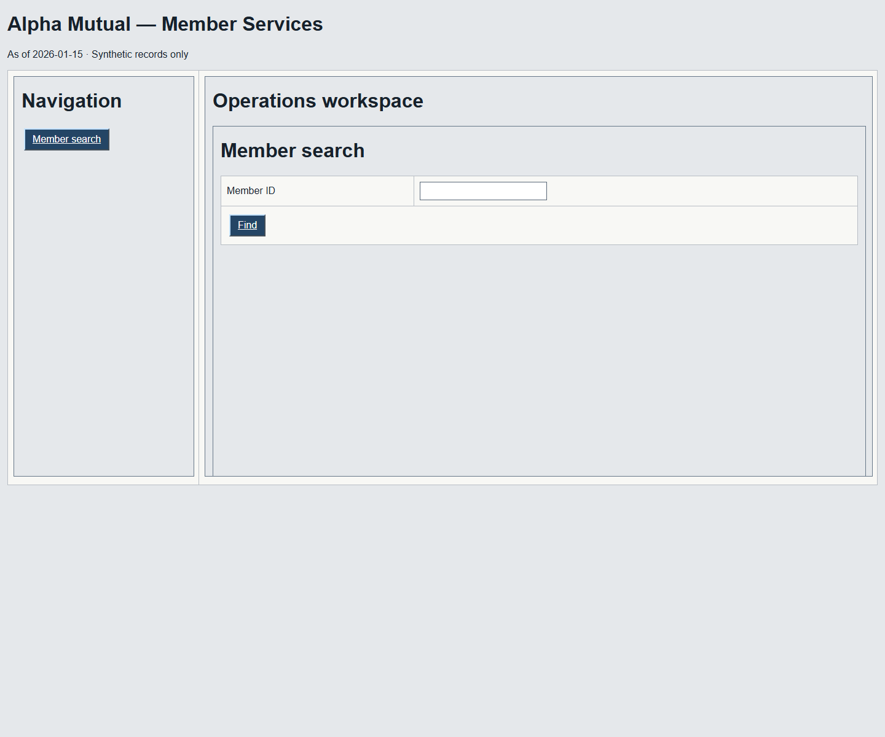
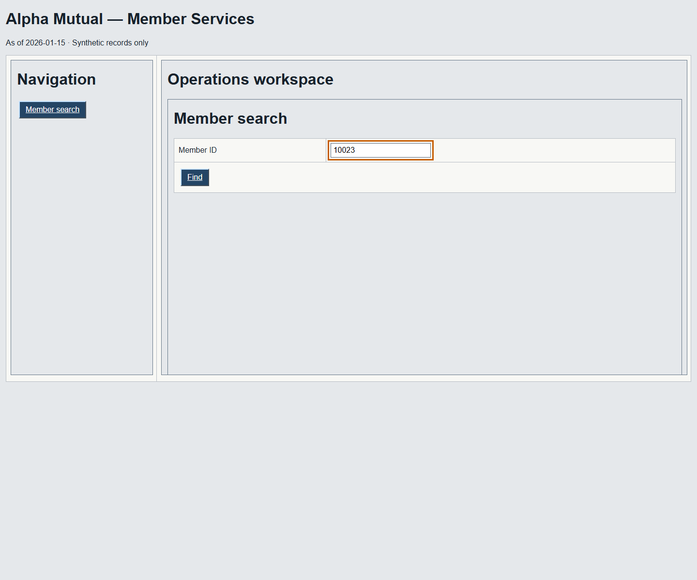
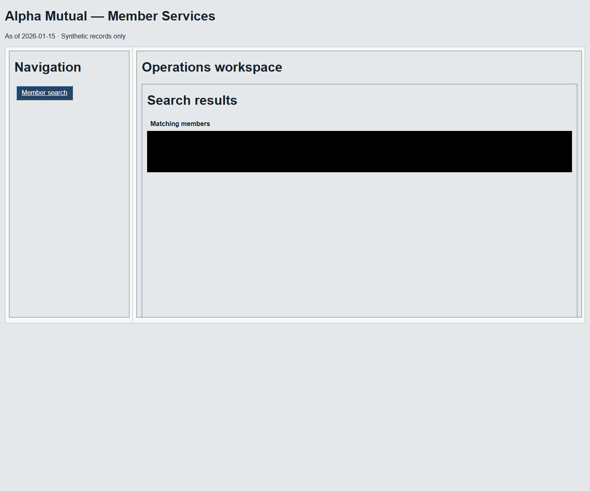
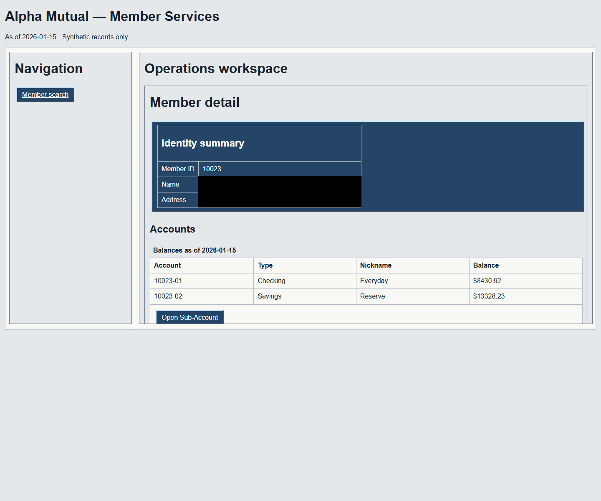
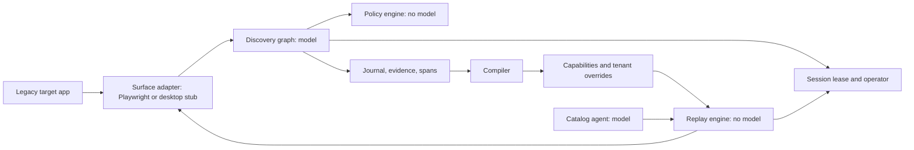
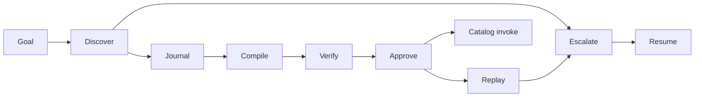
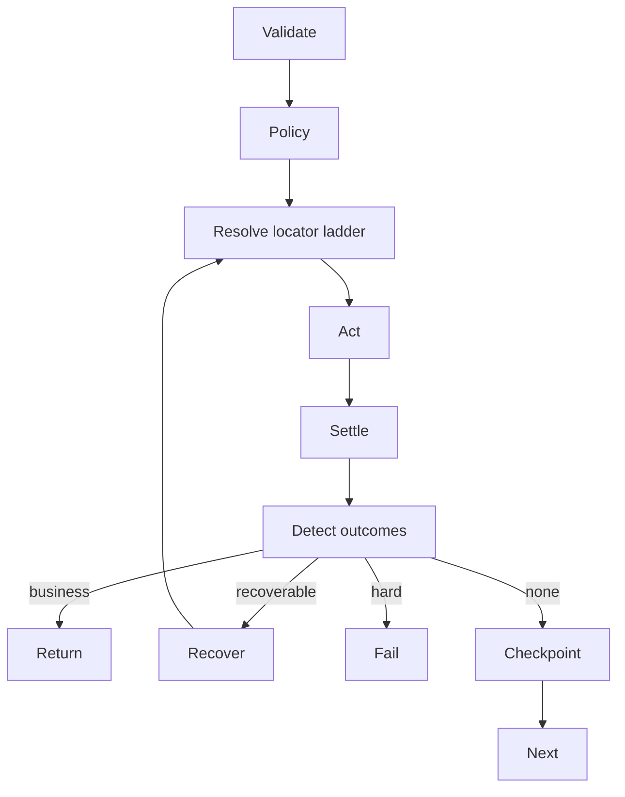
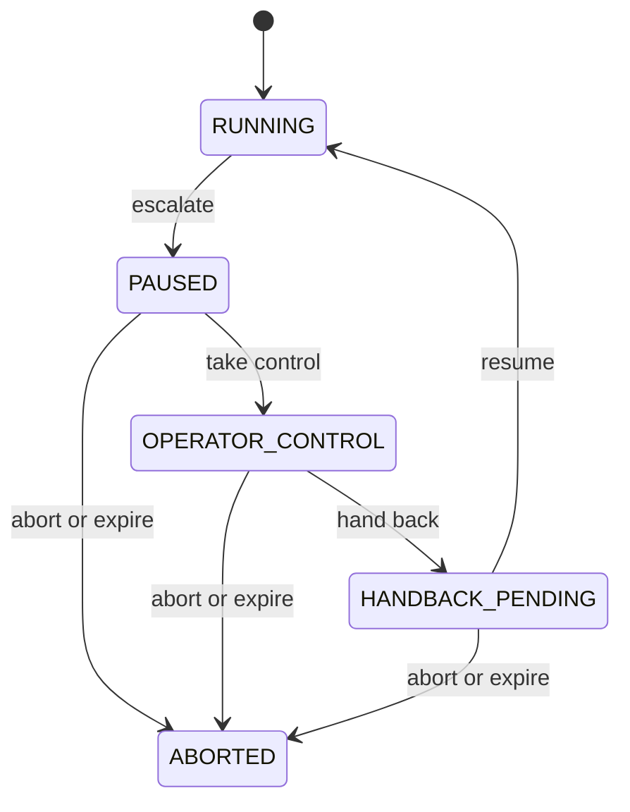

# CUA

## What this is

Legacy bank applications often expose stable workflows only through a browser UI. This project
uses an LLM to discover such a workflow once, records the run, and compiles it into a typed
capability.

Approved capabilities replay through deterministic code. Replay resolves recorded locator
ladders, applies policy, evaluates data predicates, and returns a typed result without a model in
the decision loop.

Every step links to the observation and decision that produced it. Run journals are hash chained,
evidence blobs are content addressed, and approval is bound to the artifact content digest.

Start with the [evidence index](evidence/demo/README.md) and
[requirement summaries](evidence/demo/SUMMARY.md). Discovery used `gpt-6-astra`; the
catalog agent used `gpt-5.6-luna`. Total recorded live spend is **$3.7975124**:
$3.583646 for the retained escalation-discovery attempts, $0.213822 for discovery-010, and
$0.0000444 for the catalog selection.

| Search | Results | Detail, masked | Balance, masked |
|---|---|---|---|
|  |  |  |  |

## Status at a glance

| Brief requirement | Where implemented | Evidence summary |
|---|---|---|
| 3.1 Goal-driven agent loop | `src/cua/discovery/graph.py` | [Discovery](evidence/demo/SUMMARY.md#31-goal-driven-agent-loop) |
| 3.2 Structured artifact | `src/cua/domain/capability.py`, `src/cua/discovery/compiler.py` | [Artifact](evidence/demo/SUMMARY.md#32-structured-artifact) |
| 3.3 Deterministic replay | `src/cua/replay/executor.py` | [Replay](evidence/demo/SUMMARY.md#33-deterministic-replay) |
| 3.4 Safety & policy guardrails | `src/cua/policy/`, `src/cua/observability/redaction.py` | [Safety](evidence/demo/SUMMARY.md#34-safety--policy-guardrails) |
| 3.5 Evidence / observability | `src/cua/observability/` | [Evidence](evidence/demo/SUMMARY.md#35-evidence--observability) |
| 3.6 Human-in-the-loop escalation & handoff | `src/cua/escalation/` | [Handoff](evidence/demo/SUMMARY.md#36-human-in-the-loop-escalation--handoff) |
| 3.7 Heterogeneity & scale | Surface seam, desktop stub, tenant overrides, [REPORT.md §4](REPORT.md#4-heterogeneity--multi-tenant) | [Heterogeneity](evidence/demo/SUMMARY.md#37-heterogeneity--scale) |

## Architecture



The surface normalizes browser accessibility data into domain observations. Domain, policy, and
replay stay framework-free; LangGraph is limited to discovery, and LangSmith export is optional.



The journal is the evidence transcript; the compiler deterministically derives the artifact.
Approval binds a digest, so edited content requires review again.



Replay checks outcomes before checkpoints so member not found is a business answer. Lower-ranked
locator success and surface fingerprints create explicit drift records.



The lease answers who controls the live session. LangGraph checkpoints preserve graph data; the
lease and CDP connection preserve browser-session continuity.

## Quickstart

Python 3.12 and uv are required. Process environment variables take precedence over .env.

Windows PowerShell:

```powershell
git clone https://github.com/AryanAjmera18/interface.ai.git
cd interface.ai
uv sync --locked
uv run --locked playwright install chromium
Copy-Item .env.example .env
uv run --locked cua doctor
uv run --locked python -m cua.target_app
```

Linux or macOS:

```sh
git clone https://github.com/AryanAjmera18/interface.ai.git
cd interface.ai
uv sync --locked
uv run --locked playwright install chromium
cp .env.example .env
uv run --locked cua doctor
uv run --locked python -m cua.target_app
```

## Demo path

All reviewer-created output goes under `runs/`, which Git ignores. Start the target app
in a separate terminal with `uv run --locked python -m cua.target_app`.

### Track A: no API key, free

1. `uv run cua verify capabilities/look_up_member_savings_balance@1.0.0.json`
   Expected: every provenance, evidence, journal-chain, recompilation, and approval check passes.
2. `uv run cua replay capabilities/look_up_member_savings_balance@1.0.0.json --tenant alpha --input member_id=10023 --output runs/replay-success`
   Expected: `success` with a redacted savings-balance output.
3. `uv run cua replay capabilities/look_up_member_savings_balance@1.0.0.json --tenant alpha --input member_id=99999 --output runs/replay-not-found`
   Expected: the declared `member_not_found` business outcome.
4. `uv run cua replay capabilities/look_up_member_savings_balance@1.0.0.json --tenant alpha --input member_id=10023 --fault unexpected_interstitial --output runs/replay-recovered`
   Expected: a journaled recovery followed by success.
5. `uv run cua replay capabilities/look_up_member_savings_balance@1.0.0.json --tenant alpha --input member_id=10023 --fault server_error_500 --output runs/replay-hard-failure`
   Expected: a typed hard failure with step and evidence references.
6. `uv run cua replay capabilities/look_up_member_savings_balance@1.0.0.json --tenant beta --input member_id=10023 --output runs/cross-tenant-before`
   Expected: fingerprint drift and an alpha-label checkpoint failure.
7. `uv run cua verify capabilities/overrides/beta/look_up_member_savings_balance.json --base capabilities/look_up_member_savings_balance@1.0.0.json`
   Expected: the override is bound to the approved base digest.
8. `uv run cua replay capabilities/look_up_member_savings_balance@1.0.0.json --tenant beta --input member_id=10023 --override capabilities/overrides/beta/look_up_member_savings_balance.json --output runs/cross-tenant-after`
   Expected: success on beta with the same approved capability.
9. Follow “Take over the session yourself” below.
   Expected: the paused run resumes only after named control transfer and handback.

### Track B: OPENAI_API_KEY required

Discovery uses `gpt-6-astra` and historically cost about **$0.20** for this lookup.
Credentials are fixture-local secret references; do not pass them on the command line.

1. `uv run cua discover --goal "look up member 10023 and read their current savings balance" --target http://127.0.0.1:8099 --tenant alpha --param member_id=10023 --output runs/discovery-new`
   Expected: a new discovery manifest and hash-chained journal under `runs/discovery-new/`.
2. `uv run cua compile runs/discovery-new -o runs/look_up_member_savings_balance.json`
   Expected: a new draft artifact derived from that journal; committed capabilities are untouched.
3. `uv run cua verify runs/look_up_member_savings_balance.json --run-dir runs/discovery-new`
   Expected: provenance and evidence verification passes against the new run.
4. `uv run cua approve runs/look_up_member_savings_balance.json --actor "Your Name" --reason "Reviewed new run" --run-dir runs/discovery-new`
   Expected: status becomes approved and the approval digest is journaled in the new run.
5. `uv run cua catalog-invoke --question "What is member 10023's savings balance?" --tenant alpha --output runs/catalog-invoke`
   Expected: `gpt-5.6-luna` selects the typed tool, then model-free replay returns a
   locally redacted result. The committed example cost $0.0000444.

### Take over the session yourself

Run:

```sh
uv run cua replay capabilities/look_up_member_savings_balance@1.0.0.json --tenant alpha --input member_id=10023 --fault server_error_500 --escalate-on-failure --operator-port 8100 --output runs/escalation-manual
```

The terminal prints `operator_url=http://127.0.0.1:8100/operator` and holds a visible
Chromium session. Open that URL, choose the request, select **Take control**, correct the page in
the visible browser so it reaches the expected member state, then select **Hand back**. Replay
re-observes the same session and resumes only if the recorded checkpoint is satisfied.

The committed escalation evidence used the explicitly labeled `scripted-operator` actor
for repeatability. The steps above exercise the same lease, CDP session, AX diff, and handback with
a person in control.

## Running without live services

`uv run pytest -m "not live"` is fully offline. Unit tests inject fake or recorded
model responses. Only discover with a real profile and catalog-invoke require OPENAI_API_KEY;
replay, verification, fault tests, and cross-tenant runs do not.

## The capability artifact

This excerpt is copied from
`capabilities/look_up_member_savings_balance@1.0.0.json`. Ellipses shorten only long
hashes.

```json
{
  "step": {
    "step_id": "01M2YKG01A0KZ0H35Y8E00FRTN",
    "ordinal": 6,
    "intent": "Read member the requested member's savings balance",
    "action": {"kind": "read_value", "output_name": "savings_balance", "attribute": "name"},
    "target": {
      "match_policy": "require_unique",
      "candidates": [
        {"strategy": "ax_role_name_scoped", "uniqueness_at_record": 1,
         "evidence_ref": {"evidence_id": "01M2YKFZZ4341DJDMT4JW3TZW3", "content_hash": "9d057...a49eb3a", "media_type": "application/json"}},
        {"strategy": "ax_role_name", "uniqueness_at_record": 2,
         "evidence_ref": {"evidence_id": "01M2YKFZZ4341DJDMT4JW3TZW3", "content_hash": "9d057...a49eb3a", "media_type": "application/json"}},
        {"strategy": "label_text", "uniqueness_at_record": 1,
         "evidence_ref": {"evidence_id": "01M2YKFZZ4341DJDMT4JW3TZW3", "content_hash": "9d057...a49eb3a", "media_type": "application/json"}}
      ]
    },
    "provenance": {
      "discovery_run_id": "01M2YKF25VVM1RVNVNV97TG07H",
      "observation_id": "01M2YKG7R77GADTGX1EDSQMNYZ",
      "observation_hash": "06b17...7435c",
      "decision_id": "01M2YKG01A0KZ0H35Y8E00FRTN",
      "prompt_template_id": "discovery-planner.v1",
      "prompt_hash": "065ad...c96",
      "decided_by": {"kind": "model", "provider": "openai", "model_id": "gpt-6-astra", "api_flavor": "responses", "structured_output_mode": "json_schema", "reasoning_effort": "medium"}
    }
  },
  "output": {
    "name": "savings_balance",
    "sensitivity": "pii",
    "extractor": {
      "attribute": "name",
      "target": {
        "role": "cell",
        "name_matcher": {"mode": "regex", "value": "^\\$[0-9,.]+$"},
        "within": {
          "role": "row",
          "name_matcher": {"mode": "regex", "value": "^\\d{5}-02\\s+Savings\\b"},
          "within": {"role": "table", "name_matcher": {"mode": "normalized", "value": "Member accounts"}}
        }
      }
    }
  },
  "outcome": {
    "code": "member_not_found",
    "classification": "business",
    "detect": {"kind": "text_matches", "regex": "Record not found"},
    "caller_message": "Member not found",
    "recovery": null
  }
}
```

## Multi-tenant reuse

Beta labels the same textbox “Account Holder Number,” so the approved alpha artifact records
fingerprint drift and fails its alpha-specific checkpoint
([before evidence](evidence/cross-tenant-before/manifest.json)). The separate
[beta override](capabilities/overrides/beta/look_up_member_savings_balance.json) patches only
locators and checkpoints; validation forbids changes to outcomes, risk, inputs, outputs, or
actions. It binds the approved base content digest and becomes stale if that base changes. With
the override, the same artifact succeeds
([after evidence](evidence/cross-tenant-after/manifest.json)).

## Result contract and error taxonomy

| Condition | Class | Detection | Caller receives |
|---|---|---|---|
| Goal completed | success | checkpoints and extractors pass | typed outputs |
| No member or denied record | business | declared predicate | code and caller message |
| Interstitial or expired session | recoverable history | declared predicate | eventual terminal result |
| Locator, policy, timeout, server, checkpoint | hard | executor check | expected/observed and evidence |

## Provenance and evidence

A run folder contains manifest.json, journal.ndjson, content-addressed blobs/, and local OTel
spans. Each journal record hashes the previous record; this proves local ordering and detects
editing, but it does not authenticate a same-process rewrite. External anchoring is the remedy.

Use `uv run cua verify <artifact>` for provenance and approval checks. The
[evidence index](evidence/demo/README.md) includes chain-verification commands.

## Safety

URLs are matched by parsed scheme, host, port, and path. Policy derives risk from named rules and
runs before planner dispatch and surface action. Irreversible replay needs approved content,
recorded irreversible risk, and an explicit caller flag. Page text is untrusted input. If the model follows instructions injected into a page, policy
still refuses any action outside the allowlist.

Persisted sensitive values pass the redaction choke point. Screenshots mask sensitive AX bounds.
Returning a sensitive capability output to a model provider is egress governed by OutputSpec
sensitivity; the committed catalog demo keeps its balance local.

## Testing

scripts/check.ps1 and scripts/check.sh run Ruff, formatting, strict mypy, import contracts, and
the fast test lane with an 80% coverage gate. Browser integration and live tests are separate.
Goldens update only with `pytest --update-goldens`. Hypothesis exercises hashing and
locator ordering. scripts/secret_scan.py scans tracked files and full Git history.

## Repository layout

```text
src/cua/domain          pure types and ports
src/cua/surface         browser and desktop surface seams
src/cua/policy          allowlist, risk, budgets
src/cua/observability   redaction, journals, evidence, spans
src/cua/discovery       LangGraph discovery and compiler
src/cua/replay          deterministic executor
src/cua/escalation      leases and control transfer
src/cua/catalog         approved capability tools
src/cua/cli             command entry points
src/cua/target_app      synthetic legacy fixture
```

## Design notes and limits

See [REPORT.md](REPORT.md), [discovery attempts](docs/discovery-attempts.md), and
[escalation attempts](docs/escalation-attempts.md). The desktop adapter and operator co-browsing
UI remain stubs; early evidence has documented privacy and screenshot limits.

## FAQ

### If the model can drive the UI, why record and replay?

Discovery pays model cost and latency once. A reviewed artifact then gives regulated workflows
deterministic control flow, explicit failures, stable typed inputs and outputs, provenance,
approval, and useful diffs when the UI changes.

