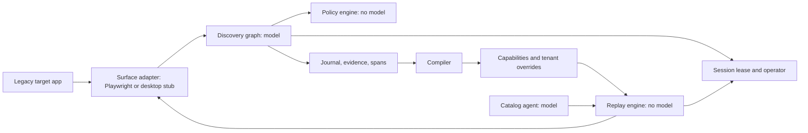
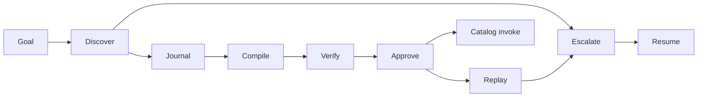
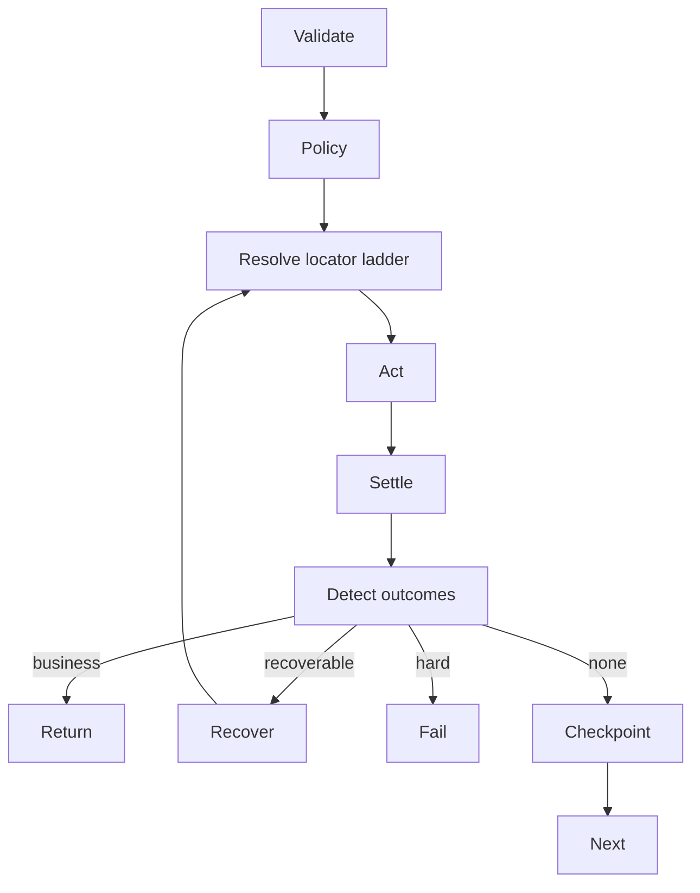
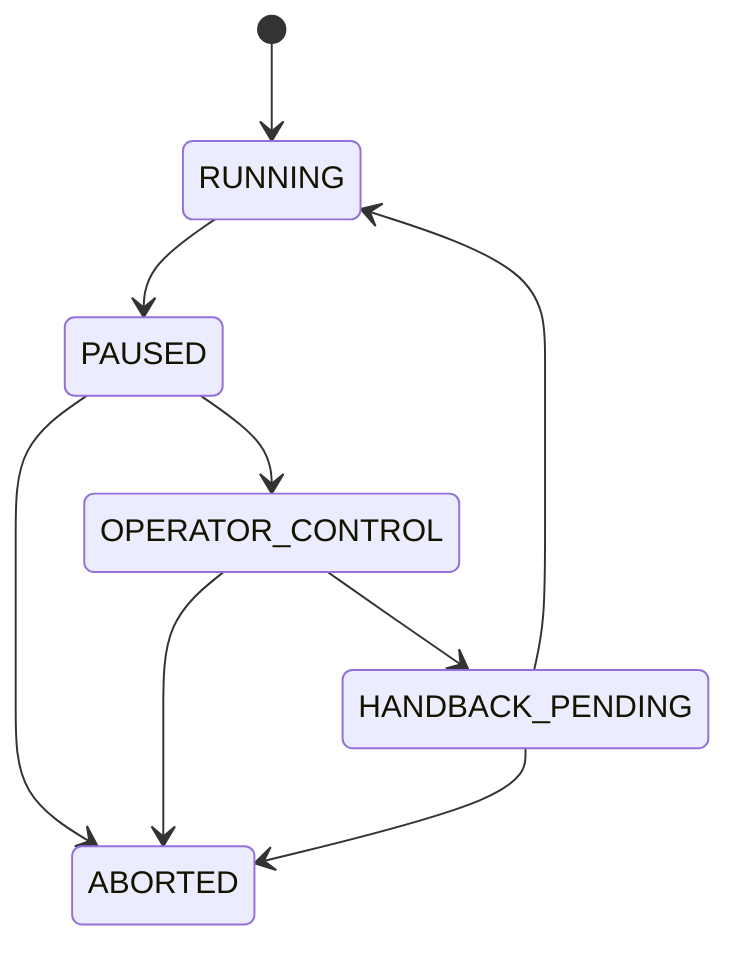

# CUA

## What this is

Legacy bank applications often expose stable workflows only through a browser UI. This project
uses an LLM to discover such a workflow once, records the run, and compiles it into a typed
capability.

Approved capabilities replay through deterministic code. Replay resolves recorded locator
ladders, applies policy, evaluates data predicates, and returns a typed result without a model in
the decision loop.

Every step links to the observation and decision that produced it. Run journals are hash chained,
evidence blobs are content addressed, and approval is bound to the artifact content digest.

## Status at a glance

| Brief requirement | Implementation | Evidence |
|---|---|---|
| 3.1 target system | cua.target_app, two tenants and injectable faults | tests/integration/target_app/ |
| 3.2 discovery | LangGraph loop, compact AX prompt, policy before action | evidence/discovery-010/ |
| 3.3 capability artifact | Pydantic schema, compiler, migrations | capabilities/ and docs/schema/ |
| 3.4 deterministic replay | framework-free executor and typed results | evidence/replay-*/ |
| 3.5 escalation | lease, same-session CDP handoff, operator console | evidence/escalation-*/ |
| 3.6 safety | structural URL allowlist, derived risk, redaction, budgets | tests/unit/policy/ |
| 3.7 observability | journal, blobs, spans, manifests, verifier | evidence/demo/README.md |

## Architecture



The surface normalizes browser accessibility data into domain observations. Domain, policy, and
replay stay framework-free; LangGraph is limited to discovery, and LangSmith export is optional.



The journal is the evidence transcript; the compiler deterministically derives the artifact.
Approval binds a digest, so edited content requires review again.



Replay checks outcomes before checkpoints so member not found is a business answer. Lower-ranked
locator success and surface fingerprints create explicit drift records.



The lease answers who controls the live session. LangGraph checkpoints preserve graph data; the
lease and CDP connection preserve browser-session continuity.

## Quickstart

Python 3.12 and uv are required. Process environment variables take precedence over .env.

Windows PowerShell:

```powershell
git clone https://github.com/AryanAjmera18/interface.ai.git
cd interface.ai
uv sync --locked
uv run --locked playwright install chromium
Copy-Item .env.example .env
uv run --locked cua doctor
uv run --locked python -m cua.target_app
```

Linux or macOS:

```sh
git clone https://github.com/AryanAjmera18/interface.ai.git
cd interface.ai
uv sync --locked
uv run --locked playwright install chromium
cp .env.example .env
uv run --locked cua doctor
uv run --locked python -m cua.target_app
```

## Demo path

Run these from another terminal while the target app is active:

```sh
uv run cua discover --goal "look up member 10023 and read their current savings balance" --target http://127.0.0.1:8099 --tenant alpha --param username=reviewer --param password=reviewer
uv run cua compile evidence/discovery-010 --output capabilities/look_up_member_savings_balance@1.0.0.json
uv run cua verify capabilities/look_up_member_savings_balance@1.0.0.json
uv run cua approve capabilities/look_up_member_savings_balance@1.0.0.json --actor "Reviewer" --reason "Reviewed evidence"
uv run cua replay capabilities/look_up_member_savings_balance@1.0.0.json --tenant alpha --input member_id=10023 --output evidence/replay-success
uv run cua replay capabilities/look_up_member_savings_balance@1.0.0.json --tenant alpha --input member_id=99999 --output evidence/replay-not-found
uv run cua replay capabilities/look_up_member_savings_balance@1.0.0.json --tenant alpha --input member_id=10023 --fault unexpected_interstitial --output evidence/replay-recovered
uv run cua replay capabilities/look_up_member_savings_balance@1.0.0.json --tenant alpha --input member_id=10023 --fault server_error_500 --escalate-on-failure --output evidence/escalation-replay
uv run cua replay capabilities/look_up_member_savings_balance@1.0.0.json --tenant beta --input member_id=10023 --override capabilities/overrides/beta/look_up_member_savings_balance.json --output evidence/cross-tenant-after
uv run cua catalog-invoke --question "What is member 10023's savings balance?" --tenant alpha --output evidence/catalog-invoke
```

Expected results are success, business outcome, visible recovery, same-session handoff,
cross-tenant success, and a Luna-selected catalog invocation. Each command writes its named
evidence directory. The HTML report command was cut; journals and manifests are the evidence
format.

## Running without live services

`uv run pytest -m "not live"` is fully offline. Unit tests inject fake or recorded
model responses. Only discover with a real profile and catalog-invoke require OPENAI_API_KEY;
replay, verification, fault tests, and cross-tenant runs do not.

## The capability artifact

```json
{
  "status": "approved",
  "inputs": [{"name": "member_id", "sensitivity": "internal"}],
  "steps": [{
    "intent": "Enter the requested member ID",
    "action": {"kind": "type_text", "value_ref": {"kind": "param_ref", "name": "member_id"}},
    "target": {"candidates": [{"strategy": "ax_role_name", "source": "ax_tree"}]},
    "checkpoint": {"kind": "ax_node_exists", "role": "heading"},
    "provenance": {"observation_hash": "...", "decided_by": {"kind": "model"}}
  }],
  "outcomes": [{"code": "member_not_found", "classification": "business"}]
}
```

The real artifact contains complete typed values, fallback ladders, timing, output extraction,
outcome handling, and content-bound approval.

## Result contract and error taxonomy

| Condition | Class | Detection | Caller receives |
|---|---|---|---|
| Goal completed | success | checkpoints and extractors pass | typed outputs |
| No member or denied record | business | declared predicate | code and caller message |
| Interstitial or expired session | recoverable history | declared predicate | eventual terminal result |
| Locator, policy, timeout, server, checkpoint | hard | executor check | expected/observed and evidence |

## Provenance and evidence

A run folder contains manifest.json, journal.ndjson, content-addressed blobs/, and local OTel
spans. Each journal record hashes the previous record; this proves local ordering and detects
editing, but it does not authenticate a same-process rewrite. External anchoring is the remedy.

Use `uv run cua verify <artifact>` for provenance and approval checks. The
[evidence index](evidence/demo/README.md) includes chain-verification commands.

## Safety

URLs are matched by parsed scheme, host, port, and path. Policy derives risk from named rules and
runs before planner dispatch and surface action. Irreversible replay needs approved content,
recorded irreversible risk, and an explicit caller flag. AX content is untrusted; policy contains
a model that follows injected text.

Persisted sensitive values pass the redaction choke point. Screenshots mask sensitive AX bounds.
Returning a sensitive capability output to a model provider is egress governed by OutputSpec
sensitivity; the committed catalog demo keeps its balance local.

## Testing

scripts/check.ps1 and scripts/check.sh run Ruff, formatting, strict mypy, import contracts, and
the fast test lane with an 80% coverage gate. Browser integration and live tests are separate.
Goldens update only with `pytest --update-goldens`. Hypothesis exercises hashing and
locator ordering. scripts/secret_scan.py scans tracked files and full Git history.

## Repository layout

```text
src/cua/domain          pure types and ports
src/cua/surface         browser and desktop surface seams
src/cua/policy          allowlist, risk, budgets
src/cua/observability   redaction, journals, evidence, spans
src/cua/discovery       LangGraph discovery and compiler
src/cua/replay          deterministic executor
src/cua/escalation      leases and control transfer
src/cua/catalog         approved capability tools
src/cua/cli             command entry points
src/cua/target_app      synthetic legacy fixture
```

## Design notes and limits

See [REPORT.md](REPORT.md), [discovery attempts](docs/discovery-attempts.md), and
[escalation attempts](docs/escalation-attempts.md). The desktop adapter and operator co-browsing
UI remain stubs; early evidence has documented privacy and screenshot limits.

## FAQ

### If the model can drive the UI, why record and replay?

Discovery pays model cost and latency once. A reviewed artifact then gives regulated workflows
deterministic control flow, explicit failures, stable typed inputs and outputs, provenance,
approval, and useful diffs when the UI changes.

